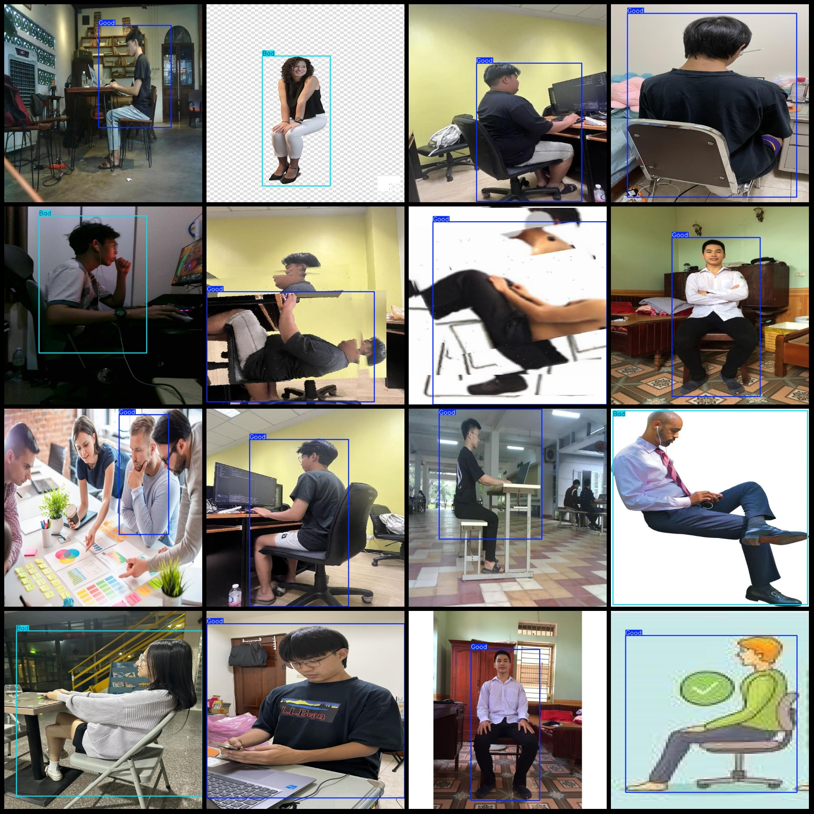
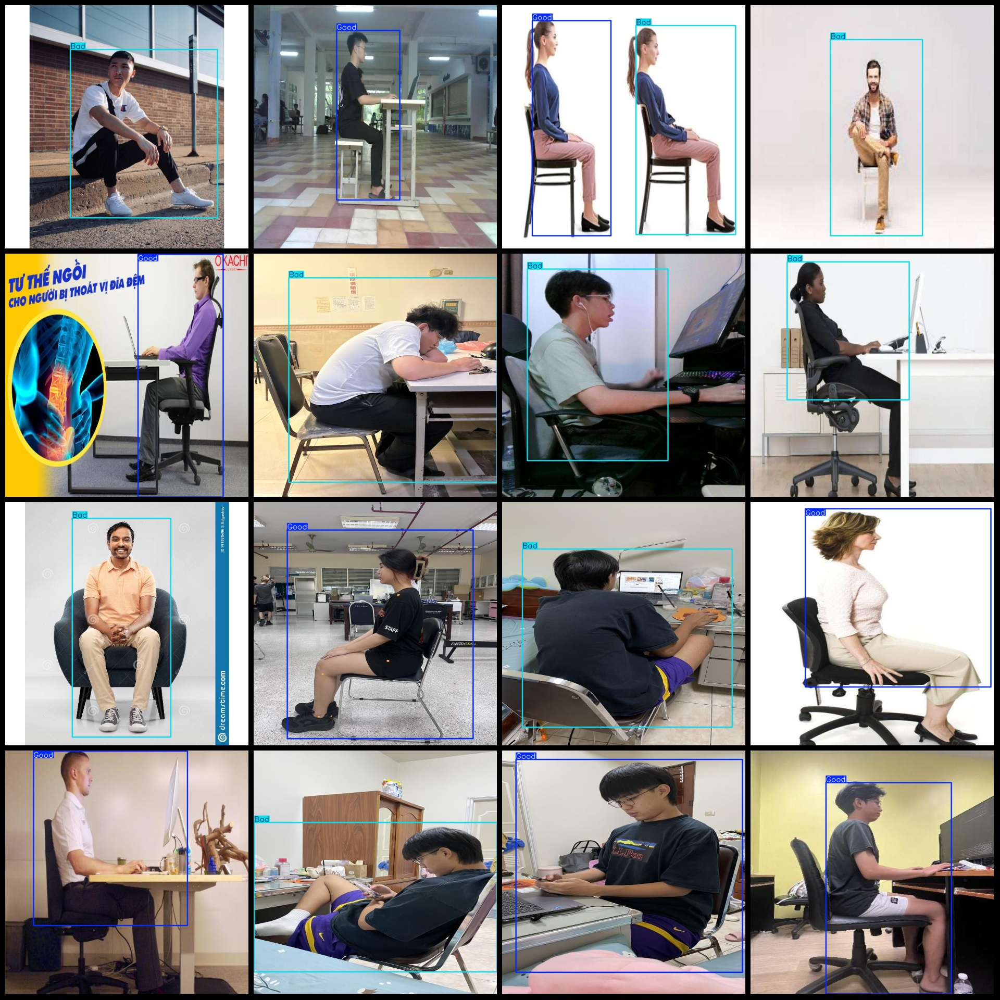

# Seated Detection Dataset (VOC+YOLO)

## Dataset Format: Pascal VOC format + YOLO format (without split path in txt files, only containing jpg images, along with corresponding VOC format xml files and YOLO format txt files)

### Image Count (Number of JPG Files): 3342

### Annotation Count (XML Files): 3342

### Annotation Count (TXT Files): 3342

### Number of Annotation Categories: 2

### Classification Names for Annotation Categories (Note: the order of categories in the YOLO format may not match this, but refer to the "labels" folder's "classes.txt"): ["Bad", "Good"]

Each category has:
- Bad bounding box count = 2301
- Good bounding box count = 1503
Total bounding boxes: 3804

Each category occupies a number of images:
- Bad occupies images = 2029
- Good occupies images = 1408

Image resolution: 640x640

Using annotation tool: labelImg
Annotation rules: draw bounding boxes for each category

Important Notice: The dataset does not have been divided into training, validation, or test sets; you need to divide it yourself.

Special Remark: This dataset does not guarantee the accuracy of the trained models or weight files.

Image Preview:

---

**Annotation Example:**

## Image

Here is a pay link on Stripe ( https://buy.stripe.com/3cs8yP7sY87d0vu9AB ). Please contact me lonlonago@foxmail.com after funding $89, and I will send you a complete data files , thank you!

